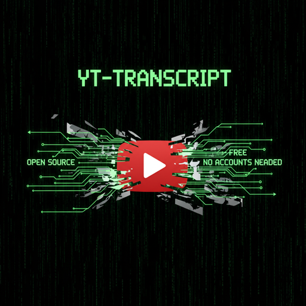

# youtube-transcript-tool

<p align="center">
  
</p>

<p align="center">
  <strong>Download, list, and translate YouTube video transcripts with ease</strong>
</p>

[](https://www.python.org/downloads/)
[](https://opensource.org/licenses/MIT)
[](https://github.com/astral-sh/ruff)
[](https://github.com/python/mypy)
[](https://www.anthropic.com/claude)
[](https://www.anthropic.com/claude/code)

A command-line tool for downloading, listing, and translating YouTube video transcripts with support for multiple output formats.

## Features

- 📥 Download transcripts from YouTube videos in multiple formats (text, JSON, SRT, WebVTT)
- 🌍 Multi-language support - download transcripts in available languages
- 🔄 Translation - translate transcripts using YouTube's automatic translation
- 📋 List available transcripts - see all languages and types available for a video
- 🐚 Shell completion for bash, zsh, and fish
- 📊 Multi-level verbosity logging (-v/-vv/-vvv)
- ✅ Type-safe with mypy strict mode
- 🔒 Security scanning with bandit, pip-audit, and gitleaks

## Quick Start

```bash
# Install from source
git clone https://github.com/dnvriend/youtube-transcript-tool.git
cd youtube-transcript-tool
uv tool install .

# Download transcript (English, plain text)
youtube-transcript-tool download "https://www.youtube.com/watch?v=VIDEO_ID"

# List available languages
youtube-transcript-tool list "https://www.youtube.com/watch?v=VIDEO_ID"

# Translate to Spanish
youtube-transcript-tool translate "URL" --to es

# Show available output formats
youtube-transcript-tool formats
```

## Usage

### Download Transcripts

```bash
# Download English transcript as plain text (default)
youtube-transcript-tool download "https://www.youtube.com/watch?v=QoAOzMTLP5s"

# Download specific language
youtube-transcript-tool download "URL" --language de

# Download as JSON format
youtube-transcript-tool download "URL" --format json

# Download German transcript as SRT subtitles
youtube-transcript-tool download "URL" -l de -f srt
```

**Supported formats:** text, json, srt, webvtt

### List Available Transcripts

```bash
# List all available transcripts with language codes and types
youtube-transcript-tool list "https://www.youtube.com/watch?v=VIDEO_ID"
```

### Translate Transcripts

```bash
# Translate to Spanish
youtube-transcript-tool translate "URL" --to es

# Translate to German as SRT subtitles
youtube-transcript-tool translate "URL" --to de --format srt
```

**Common language codes:** en (English), de (German), es (Spanish), fr (French), it (Italian), pt (Portuguese), ja (Japanese), zh (Chinese)

### Verbosity Levels

```bash
# INFO level - show high-level operations
youtube-transcript-tool -v download "URL"

# DEBUG level - show detailed information
youtube-transcript-tool -vv download "URL"

# TRACE level - show HTTP requests and library internals
youtube-transcript-tool -vvv download "URL"
```

## Documentation

- [Installation Guide](references/installation.md) - Detailed installation instructions
- [Shell Completion](references/shell_completion.md) - Setup bash, zsh, and fish completion
- [Verbosity Logging](references/verbosity.md) - Multi-level debugging guide
- [Development Guide](references/development.md) - Contributing and development setup
- [Security](references/security.md) - Security scanning and best practices

## License

This project is licensed under the MIT License - see the [LICENSE](LICENSE) file for details.

## Author

**Dennis Vriend**

- GitHub: [@dnvriend](https://github.com/dnvriend)

## Acknowledgments

- Built with [Click](https://click.palletsprojects.com/) for CLI framework
- Uses [youtube-transcript-api](https://github.com/jdepoix/youtube-transcript-api) for transcript downloading
- Developed with [uv](https://github.com/astral-sh/uv) for fast Python tooling

---

**Generated with AI**

This project was generated using [Claude Code](https://www.anthropic.com/claude/code), an AI-powered development tool by [Anthropic](https://www.anthropic.com/). Claude Code assisted in creating the project structure, implementation, tests, documentation, and development tooling.

Made with ❤️ using Python 3.14
